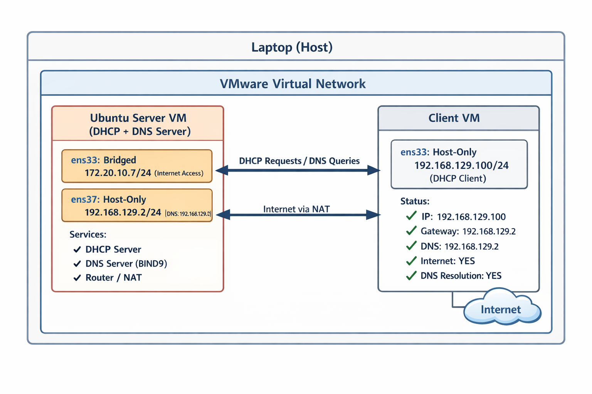

# 🖧 Home Lab: DHCP & DNS Server with Ubuntu

This project demonstrates how to build a small home lab network using Ubuntu Server as a:

* DHCP Server
* DNS Server (BIND9)
* Router (NAT)

---

## 📌 Architecture

<p align="center">
  
</p>

### Network Design

| Component     | IP Address      | Role               |
| ------------- | --------------- | ------------------ |
| Ubuntu Server | 192.168.129.2   | DHCP, DNS, Gateway |
| Client VM     | 192.168.129.100 | DHCP Client        |
| External NIC  | 172.20.10.x     | Internet Access    |

---

## ⚙️ Features

* Automatic IP assignment via DHCP
* Local DNS resolution using BIND9
* Internet access via NAT
* Multi-NIC configuration

---

## 🧰 Technologies Used

* Ubuntu Server
* ISC DHCP Server
* BIND9
* iptables (NAT)
* VMware

---

## 🚀 Setup Steps

### 1. Install Required Packages

```bash
sudo apt update
sudo apt install isc-dhcp-server bind9 -y
```

### 2. Configure DHCP

Edit:

```
/etc/dhcp/dhcpd.conf
```

### 3. Configure DNS (BIND9)

Edit:

```
/etc/bind/named.conf.options
/etc/bind/named.conf.local
```

### 4. Enable IP Forwarding

```bash
sudo sysctl -w net.ipv4.ip_forward=1
```

### 5. Configure NAT

```bash
sudo iptables -t nat -A POSTROUTING -o ens33 -j MASQUERADE
```

---

## 🧪 Testing

* `ip a` → Check IP assignment
* `ping 8.8.8.8` → Internet connectivity
* `nslookup google.com` → DNS resolution

---

## 📚 Learning Outcomes

* Networking fundamentals (DHCP, DNS)
* Linux server configuration
* NAT and routing
* Troubleshooting network issues

---

## 🧠 What I Learned

- Configured DHCP server to assign dynamic IP addresses
- Implemented DNS resolution using BIND9
- Enabled NAT for internet access
- Troubleshot network connectivity issues
  
## 🧑‍💻 Author

SHIN - DevOps Learner 🚀
